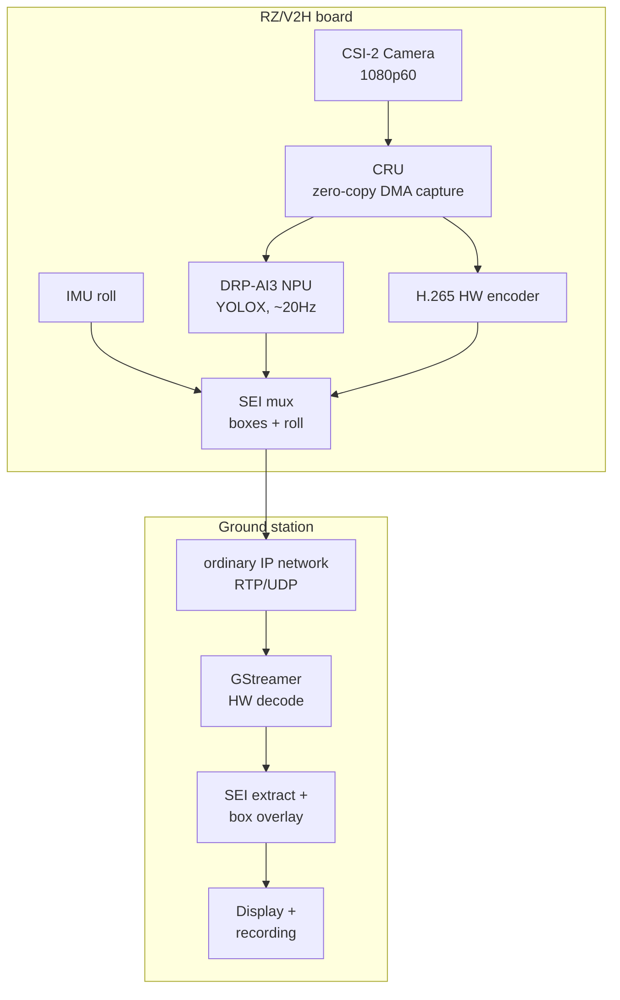

# RZ/V2H Camera → AI Detection → H.265 Stream

A reference pipeline for the Renesas RZ/V2H RDK: capture a MIPI CSI-2 camera at
1080p60, run object detection on the DRP-AI3 NPU concurrently, encode H.265 in
hardware with the detection boxes embedded directly in the video stream, and
send it over an ordinary RTP/UDP connection to a viewer on another machine.

No custom transport, no special network hardware — this runs over whatever
IP network the board and the viewer are already on.

## What this actually does

- **1920×1080@60fps** capture from a CSI-2 camera (developed against a
  TechNexion TEVS/TEVM-AR0234 global-shutter module; any V4L2 source the
  RZ/V2H CRU driver supports should work with minor changes to `camera.cpp`).
- **YOLOX object detection** on the DRP-AI3 NPU at ~20Hz, running on its own
  thread, decoupled from the 60fps video path — detection doesn't cost frame
  rate.
- **H.265 encode in hardware** (`omxh265enc`), with detection boxes and IMU
  roll data embedded directly in the encoded stream as HEVC SEI NAL units —
  no separate metadata channel to fall out of sync with the picture.
- **Adaptive bitrate**, driven by board-side WiFi signal/retry stats and
  RX-reported packet loss, so it degrades bitrate/framerate under a weakening
  link instead of just dropping frames.
- **Near-zero CPU overhead.** Camera capture, colorspace conversion, and
  encode are all hardware paths (zero-copy DMA throughout) — on the reference
  hardware this holds 1080p60 with live detection at roughly 8–12% CPU,
  leaving the SoC's general-purpose cores free for whatever else needs to run
  alongside it.
- **Autonomous board side, operator-driven ground side.** The board discovers
  and waits for a viewer over UDP broadcast, self-recovers from a dropped
  link or a crashed engine process, and needs no manual intervention after
  boot. The ground side is a small console app: discover, connect, start,
  stop.

## Architecture

What the image actually passes through, hardware-wise, from sensor to
displayed frame:



The camera→CRU→encoder path and the CRU→NPU path both read the same
zero-copy DMA-BUF frame — the NPU never blocks or slows down the video
path, it just reads whatever's currently in the ring on its own schedule.
Detection boxes and IMU roll ride inside the H.265 stream itself as SEI
data, not a separate channel, so they can never drift out of sync with the
picture they describe. Not pictured above: a small feedback path runs the
other way too — the ground station's measured loss/signal quality goes
back to the board over UDP so the encoder can back off bitrate before the
link actually breaks, rather than after (see the wire protocol table below
for that port).

## Why two processes

`app_m5` (camera capture + DRP-AI inference) and `capture_encoder_m5` (GStreamer
encode + SEI injection) are deliberately separate processes talking over a
Unix domain socket, not one binary. GStreamer's `gst_init()` and the DRP-AI
TVM/LLVM runtime's static initialization conflict when loaded into the same
process — this was hit directly during development, not a design taken on
faith. `enc_ipc.h` is the shared, header-only protocol between them: frame
handles and detection boxes go one way, refcounted `dma-buf` file descriptors
(passed over the socket via `SCM_RIGHTS`) go the other.

One non-obvious consequence of the split: **the encoder process owns the
camera's capture buffers**, not the capture app. `capture_encoder_m5` allocates the
DMA-BUF ring at startup and hands the buffers to `app_m5`, which then feeds
them straight into V4L2 via `VIDIOC_QBUF`. The camera DMAs frames directly
into the encoder's buffers, and the NPU reads them by physical address —
zero copies in either direction. This is the reverse of the obvious design
(capture app owns buffers, exports them to the encoder); the obvious version
was tried first and reliably produced corrupted/green frames on this
platform. Worth knowing before "fixing" it back.

## Layout

```
TX/
  board_tx.py              board-side supervisor: discovery, control-plane
                          state machine, spawns/monitors the engine, telemetry
  tx_config.py            board-side config (NIC, engine binary paths, ports)
  link_proto.py           wire protocol shared with RX (byte-identical copy)
  cam-60fps.sh             one-shot camera mode-set + manual-exposure script
  board-tx.service           systemd unit for unattended board boot
  engine_app_src/          app_m5: camera capture + YOLOX/DRP-AI inference
    main_yolox.cpp           entry point, capture/inference/IPC threads
    camera.cpp / .h          V4L2 capture, external dma-buf adoption, AE
    bbox_udp.cpp / .h        legacy UDP-JSON detection sidecar (fallback)
    sei_box.h                SEI wire-format struct defs (shared, see below)
    imu_roll.h               IMU roll reader (LSM6DSO16IS over I2C)
    enc_ipc.h                app<->encoder IPC protocol (shared, see below)
  engine_enc_src/          capture_encoder_m5: GStreamer H.265 encode + SEI + AQC
    capture_encoder.cpp              entry point, encoder main loop, AQC controller
    stream_enc.cpp / .h      GStreamer pipeline wrapper, SEI pad-probe
    aqc_selftest.cpp         host-buildable regression test for the AQC ladder
    sei_e2e_test.cpp         board test: real encoder round-trip, SEI intact
    sei_roll_harness.cpp     board test: drives the real SEI/roll code path
    host_sei_test.cpp        host-buildable unit test: roll math, struct layout
    sei_box.h / enc_ipc.h    identical copies of the app-side headers

RX/
  ground_rx.py                ground-station supervisor: discovery, control-plane
                            state machine, auto-reconnect/retry, telemetry
  stream_viewer.py               the actual viewer: GStreamer decode, SEI
                            extraction, detection-box overlay, horizon-lock,
                            recording
  rx_config.py               ground-station config (interface, AP polling)
  link_proto.py              wire protocol shared with TX (byte-identical copy)

ros2_bridge/               optional: republishes the bbox_udp sidecar (see
                            below) as vision_msgs ROS 2 topics -- purely
                            additive, see ros2_bridge/README.md
```

`sei_box.h` and `enc_ipc.h` appear twice (once under each `engine_*_src/`)
because `app_m5` and `capture_encoder_m5` are separate binaries with separate build
inputs — keep both copies in sync if you change either.

## Wire protocol

| Purpose | Port | Notes |
|---|---|---|
| Discovery | UDP 50000 | board answers broadcast `DISCOVER` with `OFFER` |
| Control | TCP 50001 | board is the server; ground side connects in |
| Video (RTP/H.265) | UDP 50010 | |
| Detection sidecar (fallback) | UDP 50012 | JSON, used only if SEI is unavailable |
| Adaptive-feedback | UDP 50013 | ground -> board: loss%, receive rate |

SEI payload (embedded in the H.265 stream itself, HEVC `PREFIX_SEI_NUT`,
`user_data_unregistered`, UUID `DETBOXSEI01_DRPI`):

```
frame_seq:u32  n:u16  ver:u8  flags:u8  roll_cdeg:i16      -- 10-byte header
[ cls:u8  conf_q15:u16  x:i16  y:i16  w:i16  h:i16 ] x n    -- 11 bytes/box
```

Coordinates are center-based pixels in the source frame; `conf_q15` is
confidence scaled to `round(prob * 32767)`; `roll_cdeg` is IMU roll in
centidegrees, valid when `flags & SEI_FLAG_ROLL_VALID`. Full definitions in
`sei_box.h`.

## Building

There's no build system checked into this snapshot — the original
development flow cross-compiles by hand against the Renesas AI SDK's Yocto
toolchain:

```bash
source /opt/yocto_sdk/environment-setup-aarch64-poky-linux
$CXX ... # your usual g++ invocation, targeting engine_app_src/*.cpp
         # (needs the DRP-AI TVM runtime headers/libs) and
         # engine_enc_src/*.cpp (needs GStreamer + gstreamer-omx dev headers)
```

You'll need to work out the exact include/link flags for your SDK version —
they weren't captured as a reusable Makefile in the source tree this was
extracted from. `docs/03-ai-inference/01-drp-ai-toolchain.md` in the parent
repo (if you have it) has the toolchain version this was built and tested
against.

Python side (`board_tx.py`, `ground_rx.py`, `stream_viewer.py`) needs GStreamer's
Python bindings (`gi`, `Gst`) and, on the RX/viewer machine, a working
`nvh265dec` (GPU-accelerated H.265 decode) — pure-software decode
(`avdec_h265`) can't reliably hold 1080p60 on modest hardware.

### Planned: move to the RDK's documented CMake cross-build

The `renesas-rdk` Docker cross-build environment (built around the same
`ros2_cross_build_container` used for ROS 2 packages) also documents a
**non-ROS2 CMake path**, which would replace the hand-gathered SDK flags
above with something reproducible:

```bash
docker exec -it ros2_cross_build_container bash
arm64-chroot apt install -y <whatever dev packages engine_*_src needs>
mkdir build && cd build
cmake .. -DCMAKE_TOOLCHAIN_FILE=$TOOLCHAINS_WS/cross.cmake -DCMAKE_BUILD_TYPE=Release
make -j$(nproc)
```

(Source: `chapter-4/renesas_ai_apps/cross_build_non_ros2_apps.html` in the
RDK documentation.) **Not yet adopted** — this repo has no `CMakeLists.txt`
yet, and neither `engine_app_src/` nor `engine_enc_src/` has been tried
against this toolchain. Migrating to it is the next planned step for this
project, to close the gap above properly instead of documenting around it.

## Known rough edges

- `rx_config.py`/`tx_config.py` have real example IPs/ports from the
  development network — treat every value in them as something to replace
  for your own network, not a default that should work as-is.
- The AQC bitrate-vs-actual-framerate compensation (`YOLO_AQC_FPSDIV_BR_COMP`
  in `capture_encoder.cpp`) has a documented open question about whether the
  hardware encoder allocates bits by the pipeline's *configured* frame rate
  or the *actual* one when the AQC ladder drops to a lower fps tier — see the
  comment block above `aqc_apply_level()`. Worth re-validating on your own
  hardware before trusting it at the lower AQC tiers.
- `stream_viewer.py`'s GL-accelerated horizon-rotation path
  (`gltransformation`) is known to fail pipeline negotiation on some
  GPU/GStreamer combinations and take the whole pipeline down with it, not
  just the rotation. `--no-gl` (CPU-side rotation) is the safe default; the
  code also auto-falls-back to it if the GL pipeline fails to launch.
- This is an extract of the camera/AI/encode/managed-network-transport
  portion of a larger onboard system that also has a long-range raw-802.11
  injection transport layered underneath it for a specific long-range use case.
  That transport isn't included here — it's a different, much more
  specialized piece and didn't seem broadly useful outside that one use
  case. What's here is the general-purpose part: capture, detect, encode,
  stream, over a normal network.

## Status

Field-tested end-to-end on the reference hardware, including unattended
recovery after a cold reboot. Extracted from a larger active project, so
treat it as a working reference rather than a polished, versioned release —
file paths, exact config values, and a couple of open validation questions
(flagged above) reflect that.

## License

MIT — see [LICENSE](LICENSE).
